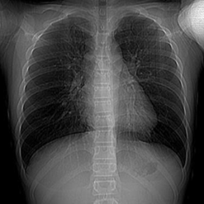
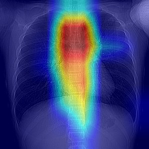
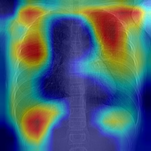
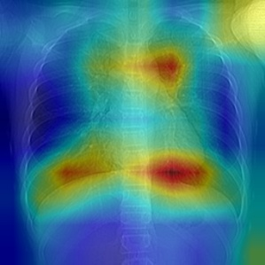

# Project_Detection_of_Lung_Diseases_Chest_X-ray
## COVID and Lung Disease Detection from Xray images
- **Intro**: Due to the quick spread of COVID-19, many patients were unable to access required treatments in time. Therefore, we are motivated to develop deep learning models that can quickly and accurately classify lung diseases and address them with the appropriate treatments in a timely matter.
- **Goal**: Find the best model with lowest misclassification rate for certainly contagious disease such as COVID and Viral Pneumonia, and highest test set accuracy. Utilize transfer learning on Pytorch pretrained Convolutional Neural Networks (CNN): ResNet, VGG, AlexNet, and a benchmark model with Logistic Regression to predict correct class labels Covid-19, Viral Pneumonia, normal(healthy) and Lung Opacity(non covid, non viral pneumonia infections) from X-ray images. 
- **Tech used**: Pytorch, pandas, numpy, opencv, matplotlib<br>

## Results
(1) 
Grad-CAM visualization on CNN models

|            Model             |                    ```Original COVID```                    |                     ```AlexNet```                     |                     ```VGG19_bn```                     |        ```ResNet50```   |           
| :--------------------------: | :---------------------------------------------------: | :-------------------------------------------------: | :----------------------------------------------------: | :---------------------------------------------------: |
|            Layer             |                     ```None```                      |                   ```Layer 5```                    |                     ```Layer 16```                     |   ```Layer 49```                      |
| Grad-CAM |  |  |  |  |

(2) Train, Test Accuracy
| Model Name \ Evaluation | Train Accuracy | Test Accuracy |
| :-----: |:--------:| :-----:| 
| AlexNet |  97.87 % |  93.86 %  |
| VGG19 with batch norm | 98.12 % | 94.33 % | 
| **ResNet 50** |  **98.59 %** |  **95.46 %** | 
| Logistic Regression | 60.84 %  | 62.24 % |

(3) Multi-class: Precision, Recall, F1 score
| Class label \ Model Name | Logistic Regression | AlexNet | VGG19_bn | Resnet50 | 
| :-----: |:--------:| :-----:| :-----:|:-----:|
| COVID | 25.86 / 28.75 / 27.23  | 96.55 / 94.65 / 95.59  | 97.7 / 94.44 / 96.05 | 98.28 / 97.71 / 97.99 | 
| Lung Opacity | 53.85 / 70.59/ 61.09 | 88.78 / 94.22 / 91.42 | 90.38 / 94.31 / 92.31 | 90.71 / 96.42 / 93.48 | 
| Normal | 88.04 / 67.14 / 76.19  | 95.65 / 93.17 / 94.39  | 95.36 / 93.96 /94.65 | 97.43 / 93.99 / 95.68 | 
| Viral Pneumonia | 0.0 / NA / NA  | 96.97 / 95.52 / 96.24  | 96.21 / 96.95 / 96.58 | 95.45 / 96.92 / 96.18 | 


## Dataset
- [COVID-19 Radiography Database (COVID-19 Chest X-ray Database)](https://www.kaggle.com/tawsifurrahman/covid19-radiography-database)
- M.E.H. Chowdhury, T. Rahman, A. Khandakar, R. Mazhar, M.A. Kadir, Z.B. Mahbub, K.R. Islam, M.S. Khan, A. Iqbal, N. Al-Emadi, M.B.I. Reaz, M. T. Islam, “Can AI help in screening Viral and COVID-19 pneumonia?” IEEE Access, Vol. 8, 2020, pp. 132665 - 132676. [Paper link](https://ieeexplore.ieee.org/document/9144185)
- Rahman, T., Khandakar, A., Qiblawey, Y., Tahir, A., Kiranyaz, S., Kashem, S.B.A., Islam, M.T., Maadeed, S.A., Zughaier, S.M., Khan, M.S. and Chowdhury, M.E., 2020. Exploring the Effect of Image Enhancement Techniques on COVID-19 Detection using Chest X-ray Images. [Paper Link](https://www.sciencedirect.com/science/article/pii/S001048252100113X?via%3Dihub)

## Files
- jupyter notebooks:
  1. Logistic Regression 
  2. AlexNet 
  3. VGG19 with batch norm
  4. ResNet50

- helper_functions: dataset, evaluation, train, plotting are written by Professor [Sebastian Raschka](https://github.com/rasbt/stat453-deep-learning-ss21/tree/main/L13/code)
- helper_GradCAM: code borrowed from Kaggle Notebook by [Debarshi Chanda](https://www.kaggle.com/debarshichanda/gradcam-visualize-your-cnn) 
